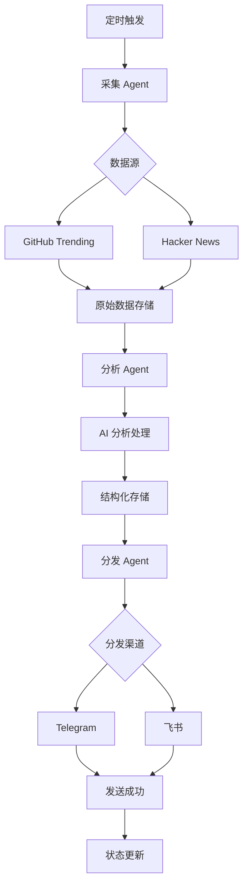

# AI 知识库助手项目 - Agent 架构文档

## 1. 项目概述

本项目是一个智能化的 AI 知识库助手系统，能够自动从 GitHub Trending 和 Hacker News 等渠道采集 AI/LLM/Agent 领域的最新技术动态，通过 AI 分析进行结构化处理，并支持多渠道（Telegram/飞书）的内容分发，为开发者提供实时、高质量的技术资讯服务。

## 2. 技术栈

### 核心框架
- **Python 3.12+** - 主要开发语言
- **OpenCode** - Agent 开发与编排平台
- **国产大模型** - 深度求索、智谱AI、月之暗面等
- **LangGraph** - Agent 工作流编排
- **OpenClaw** - 网页抓取与数据提取

### 数据存储
- **JSON 文件存储** - 结构化知识存储
- **SQLite/PostgreSQL** - 元数据管理（可选）
- **向量数据库** - 语义检索（未来扩展）

### 消息分发
- **Telegram Bot API** - Telegram 频道推送
- **飞书开放平台** - 飞书群组/频道推送
- **Webhook** - 通用 HTTP 通知

## 3. 编码规范

### 代码风格
- **PEP 8** - Python 代码规范
- **snake_case** - 变量、函数、方法命名
- **Google 风格 docstring** - 文档字符串格式

### 日志与输出
- **禁止裸 print()** - 所有输出必须通过 logging 模块
- **结构化日志** - 使用 JSON 格式日志便于分析
- **日志级别** - DEBUG、INFO、WARNING、ERROR、CRITICAL

### 错误处理
- **异常捕获** - 所有可能失败的操作必须有异常处理
- **错误恢复** - 实现重试机制和优雅降级
- **监控告警** - 关键错误触发告警通知

## 4. 项目结构

```
ai-knowledge-base/
├── .opencode/              # OpenCode 配置
│   ├── agents/            # Agent 定义文件
│   │   ├── collector/     # 采集 Agent
│   │   ├── analyzer/      # 分析 Agent
│   │   └── distributor/   # 分发 Agent
│   └── skills/            # 技能定义
│       ├── web_scraping/  # 网页抓取技能
│       ├── ai_analysis/   # AI 分析技能
│       └── notification/  # 通知技能
├── knowledge/             # 知识库数据
│   ├── raw/              # 原始采集数据
│   │   ├── github/       # GitHub Trending 原始数据
│   │   └── hackernews/   # Hacker News 原始数据
│   └── articles/         # 处理后的知识条目
│       ├── pending/      # 待处理条目
│       ├── processed/    # 已处理条目
│       └── archived/     # 已归档条目
├── config/               # 配置文件
│   ├── agents.yaml       # Agent 配置
│   ├── sources.yaml      # 数据源配置
│   └── channels.yaml     # 分发渠道配置
├── src/                  # 源代码
│   ├── collectors/       # 采集器实现
│   ├── analyzers/        # 分析器实现
│   ├── distributors/     # 分发器实现
│   └── utils/           # 工具函数
├── tests/                # 测试代码
├── logs/                 # 日志文件
├── requirements.txt      # Python 依赖
├── AGENTS.md            # 本文档
└── README.md            # 项目说明
```

## 5. 知识条目 JSON 格式

```json
{
  "id": "unique-uuid-v4",
  "title": "文章标题或项目名称",
  "source_url": "https://原始来源链接",
  "source_type": "github_trending|hacker_news|custom",
  "source_metadata": {
    "rank": 1,
    "stars": 1500,
    "language": "Python",
    "description": "原始描述",
    "author": "作者或组织",
    "published_at": "2024-01-01T00:00:00Z"
  },
  "content": {
    "raw": "原始内容或摘要",
    "summary": "AI 生成的摘要（200-300字）",
    "key_points": [
      "关键点1",
      "关键点2",
      "关键点3"
    ],
    "technical_details": {
      "frameworks": ["LangChain", "OpenAI"],
      "languages": ["Python", "TypeScript"],
      "complexity": "beginner|intermediate|advanced"
    }
  },
  "analysis": {
    "category": "framework|library|tool|paper|tutorial",
    "relevance_score": 0.95,
    "novelty_score": 0.85,
    "practicality_score": 0.90,
    "tags": ["llm", "agent", "rag", "fine-tuning"],
    "recommended_audience": ["researchers", "engineers", "product-managers"]
  },
  "status": "pending|processing|analyzed|distributed|archived",
  "timestamps": {
    "collected_at": "2024-01-01T00:00:00Z",
    "analyzed_at": "2024-01-01T00:05:00Z",
    "distributed_at": "2024-01-01T00:10:00Z"
  },
  "distribution": {
    "telegram": {
      "message_id": "123456",
      "sent_at": "2024-01-01T00:10:00Z",
      "engagement": {
        "views": 1500,
        "clicks": 300
      }
    },
    "feishu": {
      "message_id": "msg_abc123",
      "sent_at": "2024-01-01T00:10:00Z"
    }
  },
  "version": 1
}
```

## 6. Agent 角色概览

| 角色 | 名称 | 职责 | 技术栈 | 输出 |
|------|------|------|--------|------|
| **采集 Agent** | `collector` | 从指定数据源采集原始内容 | OpenClaw, Requests, BeautifulSoup | 原始 JSON 数据 |
| **分析 Agent** | `analyzer` | AI 分析、分类、摘要生成 | 国产大模型, LangChain, 向量计算 | 结构化知识条目 |
| **分发 Agent** | `distributor` | 多渠道内容分发 | Telegram Bot API, 飞书 SDK | 分发状态报告 |

### 采集 Agent 详细说明
- **GitHub Trending 采集器**: 每日采集 trending repositories (AI/LLM/Agent 相关)
- **Hacker News 采集器**: 实时监控 HN 首页和 /show 板块
- **过滤规则**: 基于关键词（LLM, Agent, RAG, Fine-tuning 等）自动过滤
- **去重机制**: 基于 URL 和内容哈希值防止重复采集

### 分析 Agent 详细说明
- **内容理解**: 使用大模型理解技术内容的核心价值
- **分类系统**: 自动分类到框架、库、工具、论文、教程等类别
- **摘要生成**: 生成简洁明了的技术摘要（200-300字）
- **标签提取**: 自动提取相关技术标签
- **质量评分**: 评估相关性、新颖性、实用性

### 分发 Agent 详细说明
- **模板系统**: 支持 Markdown 和富文本模板
- **渠道适配**: 自动适配不同平台的消息格式限制
- **发送调度**: 支持立即发送和定时发送
- **效果追踪**: 跟踪消息的阅读和互动数据

## 7. 红线（绝对禁止的操作）

### 数据安全
1. **禁止硬编码敏感信息**：API 密钥、令牌等必须通过环境变量或配置文件管理
2. **禁止日志中输出敏感数据**：用户数据、API 响应中的敏感信息必须脱敏
3. **禁止未经授权的数据存储**：只能存储项目明确允许的数据类型

### 代码质量
4. **禁止裸 print() 语句**：所有输出必须通过 logging 模块，设置合适的日志级别
5. **禁止忽略异常**：所有异常必须被捕获并适当处理，不能使用空的 except 块
6. **禁止魔法数字**：所有常量必须定义为有意义的常量或配置项
7. **禁止重复代码**：相同逻辑必须抽象为函数或类

### 系统稳定性
8. **禁止无限循环**：所有循环必须有明确的退出条件和超时机制
9. **禁止阻塞主线程**：长时间操作必须使用异步或线程池
10. **禁止忽略资源清理**：文件、网络连接、数据库连接必须正确关闭

### 外部服务
11. **禁止违反服务条款**：遵守 GitHub API、Hacker News、Telegram、飞书的使用条款
12. **禁止过度请求**：实现合理的请求频率限制和退避机制
13. **禁止忽略速率限制**：严格遵守各平台的 API 速率限制

### 用户体验
14. **禁止垃圾信息**：确保分发的内容有价值、相关、非垃圾信息
15. **禁止未经同意的订阅**：用户必须明确同意接收通知
16. **禁止无法退订**：提供简单明了的退订机制

## 8. 工作流程



## 9. 监控与维护

### 健康检查
- **Agent 状态监控**: 每个 Agent 必须有心跳检测
- **数据质量监控**: 定期检查采集和分析的数据质量
- **分发成功率**: 跟踪各渠道的分发成功率

### 故障恢复
- **自动重试**: 网络错误等临时故障自动重试
- **失败通知**: 关键失败触发告警通知
- **数据备份**: 定期备份重要数据

### 性能优化
- **缓存策略**: 合理使用缓存减少重复请求
- **批量处理**: 支持批量操作提高效率
- **异步处理**: I/O 密集型操作使用异步

## 10. 扩展计划

### 短期扩展（1-3个月）
1. 增加更多数据源（arXiv, Twitter/X, Reddit）
2. 支持更多分发渠道（Slack, Discord, 微信）
3. 实现个性化推荐功能

### 中期扩展（3-6个月）
4. 增加用户反馈机制
5. 实现知识图谱构建
6. 支持自定义数据源

### 长期愿景（6-12个月）
7. 多语言支持
8. 移动端应用
9. 企业级部署方案

---

*最后更新: 2024-04-21*
*文档版本: 1.0.0*