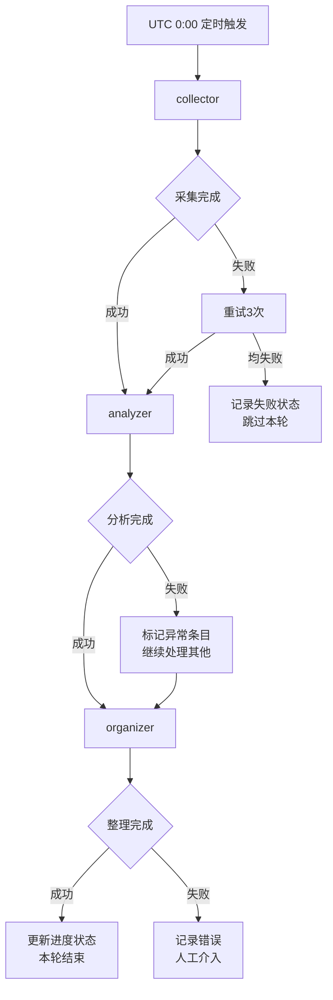

# AI 知识库 · 三 Agent PRD v0.2

## 1. 概述

构建三个 OpenCode Agent（collector → analyzer → organizer），每日 UTC 0:00 自动执行，完成 AI 技术资讯的采集、分析和整理全流程。

## 2. 总流程



### 2.1 触发机制

| 方式 | 说明 | 优先级 |
|------|------|--------|
| **定时触发** | 每日 UTC 0:00，系统级 cron | 默认 |
| **手动触发** | 用户通过 OpenCode 手动启动任意 Agent | 可选 |
| **重试触发** | 上游失败后，重试 3 次（指数退避） | 自动 |

### 2.2 执行模式

- **默认串行**：collector → analyzer → organizer，每一步依赖上一步输出
- **独立执行**：每个 Agent 可单独启动（用于调试或重跑特定环节）
- **跳过机制**：如果某一步无数据（如 collector 采集到 0 条），直接结束本轮

## 3. Agent 职责

### 3.1 collector（采集 Agent）

**角色定义文件**：`.opencode/agents/collector.md`

**职责摘要**：
- 抓取 GitHub Trending Top 50，过滤 AI/LLM/Agent 相关内容
- 抓取 Hacker News 首页和 /show 板块，过滤技术相关
- 按热度排序，生成 JSON 存入 `knowledge/raw/`

**输入**：无（外部数据源）
**输出**：`knowledge/raw/collected_{date}.json`

**关键配置**：
```yaml
sources:
  github_trending: enabled=true, limit=20
  hacker_news: enabled=true, min_score=10, limit=15
quality:
  min_entries: 15
  summary_language: zh
  max_summary_length: 200
```

### 3.2 analyzer（分析 Agent）

**角色定义文件**：`.opencode/agents/analyzer.md`

**职责摘要**：
- 读取 `knowledge/raw/` 中的原始数据
- 每条打 3 维度标签（相关性、新颖性、实用性）
- 生成技术摘要（200-300 字中文）和关键要点（3-5 个）
- 输出结构化 JSON 到 `knowledge/articles/pending/`

**输入**：`knowledge/raw/collected_{date}.json`
**输出**：`knowledge/articles/pending/analyzed_{id}.json`

**评分维度**：
| 维度 | 权重 | 说明 |
|------|------|------|
| 技术深度 | 30% | 技术实现的复杂度和专业性 |
| 创新性 | 25% | 相比现有方案的创新程度 |
| 实用性 | 25% | 解决实际问题的能力 |
| 成熟度 | 20% | 代码质量、文档完整度和社区活跃度 |

### 3.3 organizer（整理 Agent）

**角色定义文件**：`.opencode/agents/organizer.md`

**职责摘要**：
- 读取 `knowledge/articles/pending/` 的分析结果
- URL/标题/内容相似度去重（阈值 ≥85%）
- 格式标准化、分类存储到 `knowledge/articles/processed/{category}/`
- 管理知识条目的生命周期状态

**输入**：`knowledge/articles/pending/analyzed_{id}.json`
**输出**：`knowledge/articles/processed/{category}/{date}-{source}-{slug}.json`

**状态流转**：
```
pending → processing → validated → distributed → archived
     ↓          ↓            ↓
  rejected  needs_review  published
```

**文件命名规范**：`{YYYYMMDD}-{source_abbr}-{slug}.json`
- `gh` = GitHub Trending, `hn` = Hacker News

## 4. 数据模型

### 4.1 核心知识条目 JSON

```json
{
  "id": "uuid-v4",
  "title": "文章标题",
  "source_url": "https://...",
  "source_type": "github_trending|hacker_news",
  "source_metadata": { "rank": 1, "stars": 1500, "language": "Python", ... },
  "content": {
    "raw": "原始摘要",
    "summary": "AI 生成的中文摘要（200-300字）",
    "key_points": ["要点1", "要点2", "要点3"],
    "technical_details": {
      "frameworks": ["LangChain"],
      "languages": ["Python"],
      "complexity": "beginner|intermediate|advanced"
    }
  },
  "analysis": {
    "category": "framework|library|tool|paper|tutorial|news",
    "relevance_score": 0.95,
    "novelty_score": 0.85,
    "practicality_score": 0.90,
    "tags": ["llm", "agent", "rag"],
    "recommended_audience": ["researchers", "engineers"]
  },
  "quality_score": 8,
  "status": "pending|processing|analyzed|validated|distributed|archived",
  "timestamps": {
    "collected_at": "...",
    "analyzed_at": "...",
    "organized_at": "..."
  },
  "version": 1
}
```

### 4.2 目录结构

```
knowledge/
├── raw/                           # collector 输出
│   └── collected_{YYYYMMDD}.json
├── articles/
│   ├── pending/                   # analyzer 输出
│   │   └── analyzed_{id}.json
│   ├── processed/                 # organizer 输出
│   │   ├── framework/
│   │   ├── library/
│   │   ├── tool/
│   │   ├── paper/
│   │   ├── tutorial/
│   │   └── news/
│   └── archived/                 # 已归档
└── progress.json                  # 进度追踪（见第7节）
```

## 5. 错误处理策略

### 5.1 上游失败下游怎么办

| 场景 | 策略 |
|------|------|
| collector 失败 | 重试 3 次（指数退避：30s → 60s → 120s），均失败则跳过本轮 |
| collector 产出 0 条 | 视为正常，跳过 analyzer/organizer，记录 "无数据" |
| analyzer 部分条目失败 | 跳过失败条目，继续处理其余，标记失败原因 |
| analyzer 全部失败 | 记录错误，通知用户人工介入 |
| organizer 单文件失败 | 跳过该文件，继续处理其余 |
| organizer 去重冲突 | 保留质量评分更高的版本 |

### 5.2 数据一致性保障

- **幂等性**：每个 Agent 可安全重跑，不会产生重复数据
- **校验和**：organizer 输出文件含 SHA256 checksum
- **时间戳校验**：确保 collected_at < analyzed_at < organized_at

## 6. 数据传递方式

| 方式 | 使用场景 | 说明 |
|------|----------|------|
| **文件系统** | 主要方式 | collector 写 raw/ → analyzer 读 raw/ 写 pending/ → organizer 读 pending/ 写 processed/ |
| **进度文件** | 状态追踪 | `knowledge/progress.json` 记录每轮执行状态 |

**不使用消息队列的原因**：当前是单机定时任务，文件系统足够简单可靠。未来扩展为分布式时再引入消息队列。

## 7. 进度追踪

`knowledge/progress.json` 记录每次完整执行的进度：

```json
{
  "current_run": {
    "date": "2026-04-22",
    "started_at": "2026-04-22T00:00:00Z",
    "status": "in_progress|completed|failed",
    "steps": [
      {
        "agent": "collector",
        "status": "completed",
        "started_at": "2026-04-22T00:00:00Z",
        "completed_at": "2026-04-22T00:02:30Z",
        "result": {
          "total_items": 18,
          "github_items": 10,
          "hackernews_items": 8,
          "errors": []
        }
      },
      {
        "agent": "analyzer",
        "status": "completed",
        "started_at": "2026-04-22T00:02:30Z",
        "completed_at": "2026-04-22T00:15:00Z",
        "result": {
          "total_items": 18,
          "analyzed": 16,
          "failed": 2,
          "errors": [
            {"item": "url", "reason": "内容无法解析"}
          ]
        }
      },
      {
        "agent": "organizer",
        "status": "in_progress",
        "started_at": "2026-04-22T00:15:00Z",
        "completed_at": null,
        "result": null
      }
    ]
  },
  "history": [
    {
      "date": "2026-04-21",
      "status": "completed",
      "total_items": 15,
      "duration_seconds": 920
    }
  ]
}
```

## 8. 重跑策略

| 场景 | 策略 | 操作 |
|------|------|------|
| 单 Agent 失败重试 | 自动重试 3 次 | 从失败 Agent 开始，不重跑上游 |
| 整轮重跑 | 手动触发 | 清空该日数据后全量重跑 |
| 补跑历史日期 | 手动触发 | 指定日期参数，从 collector 开始 |
| 增量重跑 | 自动 | 只处理未处理过的文件（基于 progress.json） |

## 9. 安全与合规

- **禁止硬编码密钥**：API 密钥通过环境变量传入
- **速率限制**：遵守 GitHub API / HN 的速率限制
- **数据隔离**：不同日期的数据互不干扰
- **权限最小化**：每个 Agent 只有必要的文件系统权限（见各 Agent 定义文件）

## 10. 扩展预留

- **数据源扩展**：collector 可增加 arXiv、Twitter/X、Reddit 等来源
- **分发渠道**：当前只做整理，未来可增加 distributor Agent 分发到 Telegram/飞书
- **个性化推荐**：在 organizer 后增加 recommend Agent
- **向量化**：知识条目可导入向量数据库做语义检索

---

## 附录：开放问题决策记录

以下是对 PRD v0.1 中 4 个开放问题的决策：

| # | 问题 | 决策 |
|---|------|------|
| 1 | 上游失败下游怎么办？ | 重试 3 次（指数退避），均失败则跳过本轮，不阻塞下游 |
| 2 | 数据怎么传？文件 or 消息？ | **文件系统**，通过 `knowledge/` 目录传递 |
| 3 | 重跑策略？ | 支持自动重试、手动整轮重跑、增量重跑三种模式 |
| 4 | 进度追踪？ | `knowledge/progress.json` 记录每轮执行状态和历史 |

---

*版本：v0.2*
*更新：2026-04-22*
*状态：草案*
